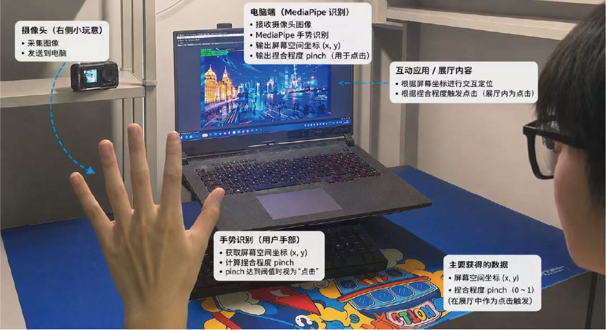

# 手势互动展厅案例

这是一个基于 Unity 和 MediaPipe 的手势互动展厅案例，核心场景来自 `MediaPipeCameraRouteTest.unity`。项目展示了如何用摄像头识别手部姿态，并把屏幕空间坐标与捏合程度映射到展厅内容点击、悬停、观察和镜头路线切换等交互中。

## 直接下载运行

如果只是想打开案例体验，请到 Release 下载完整项目包：

- [alispawn-gesture-showroom-full-project.zip](https://github.com/liqinyu167/gesture-showroom-case/releases/download/v1.0.0/alispawn-gesture-showroom-full-project.zip)
  - 完整 Unity 项目包。
  - 包含场景、MediaPipe 嵌入包和场景所需资源。
  - 下载后解压，用 Unity 打开项目文件夹即可。
- [alispawn-gesture-showroom-source.zip](https://github.com/liqinyu167/gesture-showroom-case/releases/download/v1.0.0/alispawn-gesture-showroom-source.zip)
  - 轻量源码包。
  - 适合查看脚本、交互结构和二次开发参考。

Release 页面：

[v1.0.0 Gesture Showroom Case](https://github.com/liqinyu167/gesture-showroom-case/releases/tag/v1.0.0)

## Unity 打开方式

1. 下载 `alispawn-gesture-showroom-full-project.zip`。
2. 解压到本地目录。
3. 使用 Unity `2022.3.62f2c1` 或兼容的 Unity 2022.3 LTS 版本打开解压后的项目文件夹。
4. 打开主场景：

   `Assets/Scenes/MediaPipeCameraRouteTest.unity`

5. 运行场景，确保摄像头权限可用。

## 项目内容

- 主场景：`Assets/Scenes/MediaPipeCameraRouteTest.unity`
- Unity 版本：`2022.3.62f2c1`
- 核心脚本：`Assets/Scripts`
- 交互原理图：`docs/interaction-principle.png`

## 核心功能

- 摄像头图像输入。
- MediaPipe 手部识别。
- 输出屏幕空间坐标 `(x, y)`。
- 输出捏合程度 `pinch`，用于模拟点击。
- 展厅内容 hover、focus、click、observe 等交互。
- 镜头路线节点切换与调试滑杆。
- Fungus 事件桥接，用于展厅观察流程。

## 交互流程

1. 摄像头采集手部画面。
2. MediaPipe 识别手部关键点和手势状态。
3. `HandTrackingManagerV2` 计算屏幕坐标、手势状态和捏合程度。
4. `HandInputAdapter` 把手势输入转换为展厅交互层可用的数据。
5. `ShowroomInteractionManager`、`ShowroomCursor`、`InteractableItem` 等脚本处理悬停、点击和内容观察。
6. `CameraRouteController` 与 `CameraRouteNode` 控制展厅中的镜头路线跳转。

## 仓库源码说明

仓库主体保留了案例源码、场景、交互脚本和文档。为了让 Git 仓库更适合浏览与维护，完整大体积运行包放在 GitHub Release 中。

如果你直接 clone 仓库而不是下载 Release 完整包，可能需要自行恢复部分依赖：

- MediaPipe Unity Plugin `com.github.homuler.mediapipe` `0.16.3`
- Unity Package Manager 中的 URP、Cinemachine、TextMesh Pro、Unity UI、Timeline 等依赖
- 场景引用的展厅美术资源，例如 `AK Studio Art / Simple VR Gallery`

更推荐运行体验者下载 Release 中的完整项目包。

## 适用场景

这个案例可作为以下方向的参考：

- 展厅 / 展览 / 大屏互动
- 摄像头手势识别交互
- MediaPipe 与 Unity 结合
- 无接触点击与悬停交互
- 基于路线节点的展厅镜头控制

